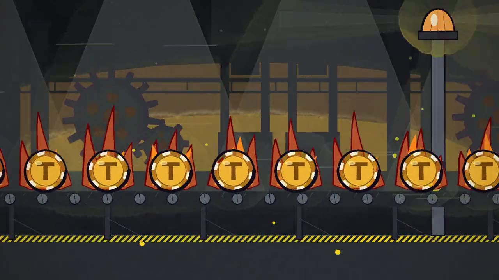
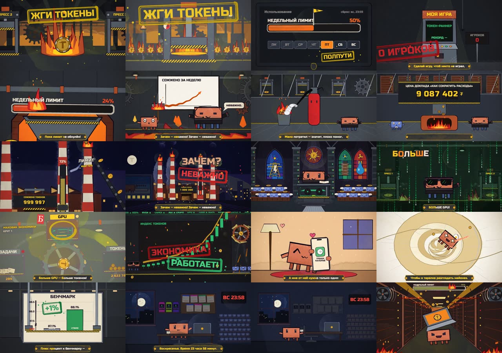

# 🔥 ЖГИ ТОКЕНЫ — гимн вайбкодеров

**Сатирический клип про AI-гонку и недельные лимиты. Ни одного кадра видеогенерации: вся акварельная анимация — код на p5.js, который написал Claude.**

[](https://www.youtube.com/watch?v=XCfsXR0rG8w)

<p align="center"><b><a href="https://www.youtube.com/watch?v=XCfsXR0rG8w">▶ Смотреть на YouTube</a></b> · автор — Андрей Овчаренко · <a href="https://t.me/Amovcharenko">tg @Amovcharenko</a> · <b><a href="https://t.me/andreydraft">📣 канал @andreydraft</a></b></p>

---

## 💡 Идея

Увидел в твиттере клип, целиком нарисованный Claude Opus 5.5, и захотел сделать так же. Хотелось постебаться над собой и над AI-гонкой: пятничный недельный лимит, «зачем — неважно», больше GPU, +1% к бенчмарку и воскресенье 23:58.



## 🎵 Звук

- Текст — вместе с Claude и GPT
- Трек и вокал — Suno v6

## 🎨 Визуал

- Акварельные мазки — [p5.brush](https://github.com/acamposuribe/p5.brush) поверх [p5.js](https://p5js.org)
- Все сцены написал Claude Code (Opus 5.5) по тексту песни, раскадровки — в [`STORYBOARD_TOKENS.md`](STORYBOARD_TOKENS.md) и [`STORYBOARD_TOKENS2.md`](STORYBOARD_TOKENS2.md)
- **Синхрон:** Whisper снимает тайминги слов, по треку строится сетка битов с сильными и слабыми долями, и каждая склейка, удар и строчка караоке привязаны к ней
- Рендер — headless Chrome на Mac mini, 1920×1080 и вертикальная 9:16-версия

## 🚧 Самое трудное

Перенос на финальную версию трека. Если модель ошибается с сеткой битов или неправильно сопоставляет новую версию со старой, картинка уезжает от музыки. Поэтому v3 — это главы v2, натянутые на новый трек через тайм-варп ([`src/tokens3/warp.js`](src/tokens3/warp.js)), а разбор аудио ([`src/tokens3/audio.js`](src/tokens3/audio.js)) пересобран с нуля и каждая склейка проверена вручную.

## ⏱ 💰 Цифры

- **Время:** один день. Трек ~1 час, клип 4–5 часов, из них 2–3 часа — ожидание рендера.
- **Деньги:** отдельно ничего. Около 5% недельного лимита подписки Claude за $200, плюс подписка Suno.

## Что внутри

| Путь | Что это |
|---|---|
| [`tokens3.html`](tokens3.html) | Финальный клип (v3) — страница, где рисуется каждый кадр, со скраббером для просмотра |
| [`src/tokens3/`](src/tokens3/) | v3: сетка битов, тайм-варп v2→v3, новые главы (сансара, майонез, финал), 9:16-рефрейминг |
| [`src/tokens2/`](src/tokens2/) | v2: десять глав (завод / acid / индастриал) — основа v3 |
| [`src/tokens/`](src/tokens/) | v1: общий кит — огонь, дата-центр, CEO, токены |
| [`tokens.html`](tokens.html), [`tokens2.html`](tokens2.html) | Ранние версии клипа, для истории |
| [`assets/tokens3/`](assets/tokens3/) | Трек, тайминги Whisper и ElevenLabs Scribe, карта битов и ударов |
| [`scripts/`](scripts/) | Сверка мастеров, Scribe, сетка битов и аудит синка ([`SYNC_AUDIT.md`](SYNC_AUDIT.md)) |
| [`src/`](src/) | Движок: персонажи, реквизит, таймлайн, караоке, вертикальный режим |
| [`render.mjs`](render.mjs) | Рендер кадров в headless Chrome и сборка MP4 через ffmpeg |

## Рендер

Нужны Node.js, Google Chrome и ffmpeg.

```bash
npm install
python3 -m http.server 8000                                  # и открыть http://localhost:8000/tokens3.html (скраббер)
node render.mjs --song=tokens3 --frames=0:242.23 --workers=4    # все кадры 16:9 в out/frames_tokens3 (можно докачивать)
node render.mjs --song=tokens3 --encode --out=out/zhgi_tokeny.mp4
node render.mjs --song=tokens3v --frames=0:242.23 --workers=4   # вертикальная 9:16-версия
node render.mjs --song=tokens3v --encode --out=out/zhgi_tokeny_vertical.mp4
node render.mjs --song=tokens3 --sheet=12,60,120 --out=out/check.jpg   # быстрый контактный лист
```

## Откуда движок

Форк [JohnHeibel/PDoomVideo](https://github.com/JohnHeibel/PDoomVideo) — открытый движок клипа *I'm Upping My P(doom)*, который Claude Opus 5.5 нарисовал целиком. Оттуда персонаж Clawd, таймлайн и рендер-пайплайн; исходный клип всё ещё собирается из [`studio.html`](studio.html) и [`src/ch/`](src/ch/).

---

⭐ Понравилось — поставь звезду репе, это лучший способ сказать спасибо. Больше таких экспериментов с Claude — в телеграм-канале **[@andreydraft](https://t.me/andreydraft)**.
